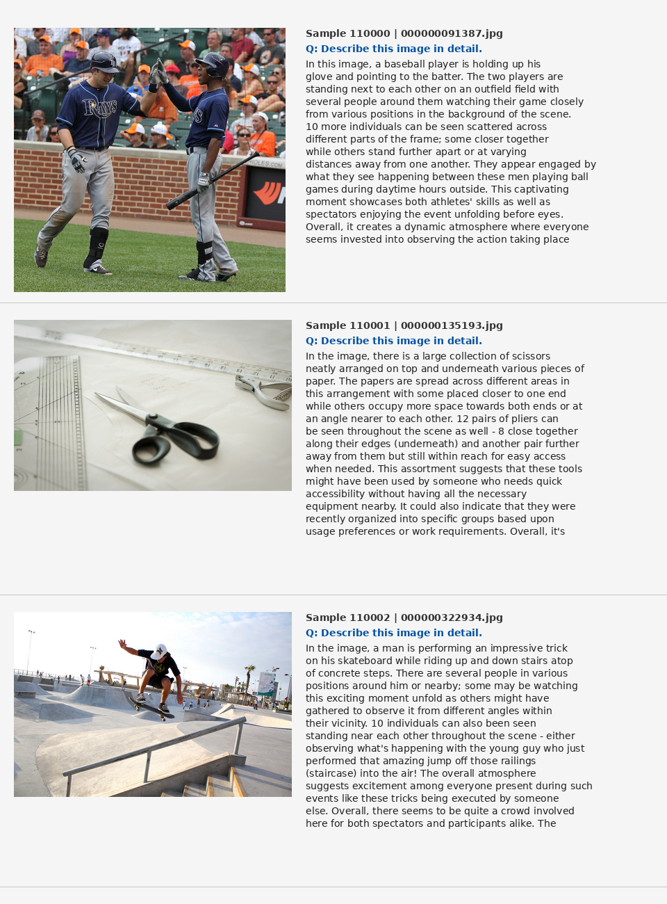

# Reproducing LLaVA: Visual Instruction Tuning

A from-scratch reproduction of the [LLaVA paper](https://arxiv.org/abs/2304.08485) ("Visual Instruction Tuning", Liu et al. 2023), built and evaluated on AWS EC2 with a single A10G GPU.



---

## Architecture

The model follows the LLaVA architecture exactly, with one key substitution: **Vicuna-13B → TinyLLaMA-1.1B** (12x smaller) due to GPU memory constraints.

```
CLIP ViT-Large-Patch14 (frozen)
        ↓
  W_proj: Linear(1024 → 2048)   ← only trainable component in Stage 1
        ↓
  TinyLLaMA-1.1B
```

Image tokens are inserted **inline** at the `<image>` token position in the human turn. The conversation template used is:

```
### Human: {text}
### Assistant: {text}
```

Loss is computed **only on assistant tokens** — human turns and image positions are masked with `-100`.

---

## Training

### Stage 1 — Pretraining (Feature Alignment)

| Setting | Value |
|---|---|
| Dataset | CC3M-595K (image-caption pairs) |
| Trainable | W_proj only |
| Objective | Next-token prediction on captions |
| Final loss | ~1.0–1.5 |

The projection layer learns to map CLIP visual features into the LLM's token embedding space.

### Stage 2 — Instruction Finetuning

| Setting | Value |
|---|---|
| Dataset | LLaVA-Instruct-150K (~110K samples used) |
| Images | COCO train2017 (118K images) |
| Trainable | W_proj + LLM |
| Epochs | 1 (paper: 3 epochs on 158K) |
| Batch size | 4 |
| Optimizer | AdamW, lr=2e-5 |
| Precision | bfloat16 + gradient checkpointing |

### Shortcuts and Differences from Paper

| Aspect | Paper | Ours |
|---|---|---|
| LLM | Vicuna-13B | TinyLLaMA-1.1B |
| Stage 2 data | 158K, 3 epochs | ~110K, 1 epoch |
| Training framework | HF Trainer + FSDP | Custom PyTorch loop |
| GPU | Multi-GPU A100 | Single A10G 24GB |
| ScienceQA training | 12 epochs dedicated | None (zero-shot) |

**Why bfloat16 + gradient checkpointing?** The A10G has 24GB VRAM. TinyLLaMA-1.1B in bfloat16 uses ~2.2GB, CLIP uses ~1.2GB, but forward activations for a full batch at fp32 would OOM. bfloat16 + gradient checkpointing brought peak usage to ~18GB at batch_size=4.

---

## Infrastructure

- **Instance**: AWS EC2 `g5.xlarge` (1x NVIDIA A10G, 24GB VRAM)
- **OS**: Ubuntu 24.04
- **CUDA**: 13.0, Driver 580.159.03
- **Key env var**: `PYTORCH_CUDA_ALLOC_CONF=expandable_segments:True` to reduce fragmentation

---

## Evaluation

### LLaVA-Bench In-the-Wild

60 open-ended visual questions across 3 categories. Scored using **Llama 3.3 70B** (via Groq) as judge, matching the paper's methodology of scoring both models simultaneously and computing:

```
relative_score = (llava_score / gpt4_score) * 100
```

Both the candidate model (ours) and the reference (GPT-4 answers from the benchmark) are scored together in the same prompt, so the denominator reflects actual GPT-4 quality per question rather than a fixed 10.

| Category | Ours | Paper LLaVA |
|---|---|---|
| Complex | 45.5% | 81.7% |
| Conversation | 33.8% | 57.3% |
| Detail | 28.3% | 52.5% |
| **Overall** | **37.9%** | **67.3%** |

**Judge model**: `llama-3.3-70b-versatile` (Groq) instead of GPT-4 as in the paper. This introduces some scoring variance — Llama 3.3 70B may apply different standards than GPT-4, making direct comparison approximate.

**Why ~56% of paper's score?** Three compounding factors: (1) TinyLLaMA-1.1B vs Vicuna-13B — a 12x parameter gap with significantly less instruction-following capability; (2) 1 epoch on 110K vs 3 epochs on 158K — roughly 1/5 of the paper's training compute; (3) different judge model.

### ScienceQA

2,017 image-context questions from the ScienceQA test split, evaluated zero-shot (no ScienceQA finetuning).

| Metric | Value |
|---|---|
| Overall accuracy (answered) | 36.1% |
| Failed to parse | 14.6% (294/2017) |
| Paper LLaVA (IMG column) | 88.0% |
| Paper LLaVA (overall) | 90.92% |

Subject breakdown:

| Subject | Ours | Paper LLaVA |
|---|---|---|
| Natural Science | 42.8% | ~88% |
| Social Science | 27.4% | ~88% |
| Language Science | 38.2% | ~88% |

**Why so low?** The paper trained LLaVA separately on ScienceQA for **12 epochs** using a chain-of-thought prompt format (predict reason first, then answer). Our model was finetuned only on open-ended visual Q&A and never saw multiple-choice format during training. It outputs full sentences ("The capital of Wyoming is Cheyenne.") instead of letters ("D"), causing 14.6% parse failures. The 36.1% accuracy on answered questions is roughly chance-level for 4-choice questions (25%) + some genuine signal.

**Answer parsing** uses the paper's 3-level cascade: (1) direct letter match, (2) `A. ` prefix format, (3) regex `The answer is ([A-E])\.?`.

---

## Qualitative Results

The model correctly identifies high-level scene content in natural images:

- **Baseball**: identifies players, crowd, daytime outdoor game
- **Scissors**: correctly identifies scissors and paper arrangement
- **Skateboarding**: identifies skateboarder performing trick, stairs, crowd

Failure modes: counting errors (hallucinates "12 pairs of pliers" when there are scissors), and occasionally confabulates specific details not present in the image.

---

## Repository Structure

```
code/
  pretraining.py           # Stage 1 training
  finetune.py              # Stage 2 training
  data_loader_instruct.py  # Stage 2 dataloader
  inference.py             # Full inference with generation params
  eval_samples_collage.py  # PNG collage output
  run_eval.py              # Generates LLaVA-Bench results CSV
  score_all.py             # Scores CSV using Llama 3.3 70B judge
  eval_scienceqa_full.py   # ScienceQA evaluation

checkpoints/
  W_proj_final.pt          # Stage 1 projection weights (8.1MB)
  W_proj_ft_final.pt       # Stage 2 projection weights
  llm_ft_final.pt          # Stage 2 LLM weights

outputs/evals/
  collage.png              # Qualitative results
  llava_bench_scored.csv   # Per-question scores
  results_summary.json     # Aggregated LLaVA-Bench results
  scienceqa_results.json   # ScienceQA results
```

---

## Reproducing

```bash
# Stage 1
python code/pretraining.py

# Stage 2
nohup python code/finetune.py > logs/finetune.log 2>&1 &

# LLaVA-Bench evaluation
python code/run_eval.py
python code/score_all.py

# ScienceQA evaluation
python code/eval_scienceqa_full.py 2>/dev/null

# Qualitative collage
python code/eval_samples_collage.py
```

Requires `HF_TOKEN` and `GROQ_KEY` in `.env`.